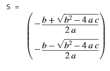

## Getting Started

<!-- https://www.tutorialspoint.com/matlab/index.htm -->

<!-- from mit ocw - [link](https://ocw.mit.edu/courses/electrical-engineering-and-computer-science/6-057-introduction-to-matlab-january-iap-2019/lecture-notes/) 

- To get MATLAB Student Verious for yourself

- You can also use MATLAB online -->

## Introduction

### Basic Commands

- `clc` - Clears the command window
- `clear all` - clears the variable in the 
memory 
- `sprintf('')` - used to print a string in the command window
- `input('')` - returns the given input
- `syms` - creates symbolic scalar variables
- `solve(eqn)` - solves the equation and returns solutions
    example
    ```
    syms a b c x
    eqn = a*x^2 + b*x + c == 0
    S = solve(eqn)
    ```
    output:

    

    Specify the variable to solve for and solve the quadratic equation for a.
    ```
    syms x y
    eqn= x^2+y^2
    S = solve(eqn,x)
    ```
### Matrix and determinant

- `rv=[1 2 3 4 5]` - row vector 
- `cv=[1;2;3;4;5]` - column vector
- `a=rv'` - Transpose
- `c=length(rv)` - length
- `d=size(rv)` - size
---
- `A = [1 2;3 4]` - creating the matrix
- `f=det(A)` - finding the determinant
- `g=rank(A)` - finding the rank
- `h=tril(A)` - finding the lower triangular 
matrix
- `i=triu(A)` - finding the upper triangular 
matrix
- `k=diag(A)` - diagonal elements
- `B=[4 5;8 12]` - creating Matrix B
- `c=A+B` - matrix addition
- `y=A*B` - matrix multiplication 
- `q=A.*B` - element wise multiplication
- `t=inv(A)` - to find the inverse

- `G=[1 2 3 4;5 6 7 8;9 10 11 12;13 14 15 16]`
- `size(G)`

- `G(2,:)=[]` - Remove the elements of row2

- `G(:,3)=[]` - Remove the elements of column 3

Solving the system of linear equation 
say , 4x+5y=7;7x+8y =21
```MATLAB
clc
clear all
A=[4 5;7 8]
b=[7;21]
x=linsolve(A,b)
x=A\b
```

### plotting of curves & surfaces

- 2d `plot()`
- 3d `plot3()`

#### imp syntax

- `subs(f,old,new)` - substitue in a function
    ```
    y=x*2;
    y2=subs(y,x,2)
    ```
- `diff` - to differentiate
- `int` - for integration
- `simplify` - perform algebric simplification
- `limit` - to find the limit of the function
- linspace - generate a number of points in a range
	- `x=linspace(0,2*pi,100`
	- alternative if ydk no. of pts is - [example](#alt-linspace)
	
		`x=0:pi/2:2*pi` - x=init:stepsize:final
- plot
- ezplot - ??
	#### note- difference between plot and ezplot
	TODO
- subplot - draw multiple graphs in 1 window - [example](#subplot-example)
- plot3
- surf - [example](#surf-example)
- ezsurf  - [example](#ezsurf-example)
	#### note- difference between surf and ezsurf
	TODO
- mesh
- meshgrid
- colormap
- prism
- flag
- hsv
- shading flat

1. Draw the curve for f(x)
    1. draw circle with center (1,3)
        ```
        t=linspace(0,2*pi,100)
        x=1+2*cos(t);
        y=3+2*sin(t);
        plot(x,y,'r.')
        axis equal
        xlabel('x-axis')
        ylabel('y-axis')
        title('circle')
        ```
    2. draw sin x, cos x, e^-x, sin 3x in one window
	
		##### alt-linspace
        x= initial: step_size: final

		##### subplot-example
        ```
        x=0:.1:2*pi
        subplot(2,2,1)
        plot(x,sin(x))

        subplot(2,2,2)
        plot(x,cos(x))

        subplot(2,2,3)
        plot(x,exp(-x))
        
        subplot(2,2,4)
        plot(x,sin(3*x))
        ``` 
2. Draw the surface of given function
	##### surf-example
    ```
    x=-1:.05:1
    y=-1:.05:1
    [x,y]=meshgrid(x,y)
    z=x*(y^2)-x^3
    surf(x,y,z)
    ```
    **OR**
	##### ezsurf-example
    ```
    syms x y %symbolic variable declaration
    f=2*((x^2)+(y^2))
    ezsurf(f)
    ```

### visualize local maxima minima and also viuslaize concativity

mathematically its done using first and second derivative test

- `fxx < 0` maxima
- `fxx > 0` minima

```
syms x real
f=input('enter the function f(x):')
fx=diff(f,x)
c=solve(fx)

% visualizing
cmin=min(double(c))
cmax=max(double(c))
figure(1)
ezplot(f,[cmin-2,cmax+2])
hold on
fxx=diff(fx,x)
for i=1:1:size(c) % for loop for number of roots
	T1=subs(fxx,x,c(i))
	T3=subs(f,x,c(i)) % find the value of function
	if(double(T1)==0)
		sprintf('The test fails at x=%d',double(c(i)))
	else
		if(double(T1)<0)
			sprintf('The maximum pt x is %d',double(c(i)))
			sprintf('The value of the function is %d',double(T3))
		else
			sprintf('The minimum pt x is %d',double(c(i)))
			sprintf('The value of the function is %d',double(T3))
		end
	end
	plot(double(c(i)),double(T3),'r*','markersize',25)
end
```

#### checking for concavity

```
% plotting inflection points for testing concavity
de=polynomialDegree(fxx)
if(de==0)
    % no inflection point
    sprintf('the given polynomial is second degree or less')
else
    d=solve(fxx) % finding inflection points
    for i=1:1:size(d)
        T2=subs(f, x, d(i))
        R1=sign(subs(fxx, x, d(i)+0.00001))
        L1=sign(subs(fxx, x, d(i)-0.00001))
        check=abs(L1-R1)
        if(check==2)
            sprintf('The point x=%d is a point of inflection',double(d(i)))
```

